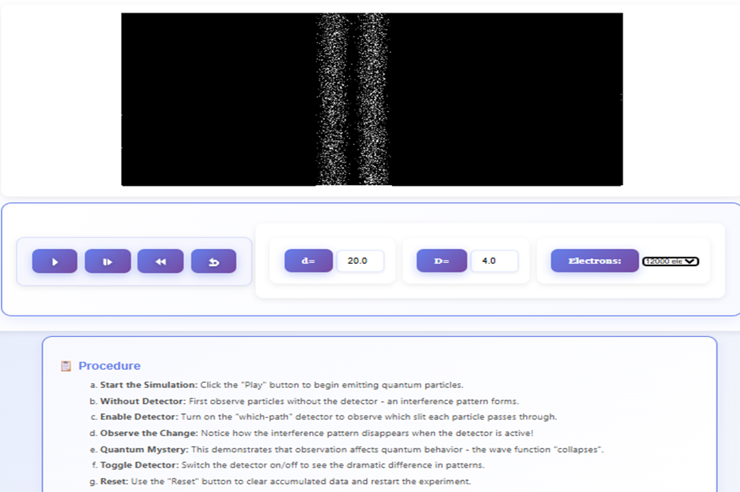

## Wave-Particle Duality Experiments

This guide outlines the steps to perform virtual experiments comparing Classical Particles, Classical Waves, and Quantum Objects.

---

## 1. Double Slit – Classical Particles (Sand)

### **Objective**
To observe how particles such as sand pass through two slits and form a distribution pattern on the screen.

### **Steps**
1.  **Open Experiment:** Select "Experiment 1: Classical Particles – Sand".
2.  **Observe the Setup:**
    * A sand container at the top.
    * Two slits (**Slit 1** and **Slit 2**).
    * A screen at the bottom.
3.  **Action:** Click **Start Sand Flow**.
    * *Observation:* Sand begins to fall through both slits.
4.  **Watch:** Observe how the sand accumulates on the screen.
5.  **Analyze:** Click **Show Graph** to view the Intensity Distribution Graph.
    * You will see **two hump-shaped distributions**.
    * There are **no interference fringes** because sand behaves like classical particles.
6.  **Controls:**
    * Click **Stop Sand Flow** to end.
    * Click **Reset Simulation** to run again.

> **Expected Observation:** The screen shows two independent piles of sand, representing classical particle behavior — **No Wave Interference**.

*Fig 1. Intensity distribution graph for Classical Particle (Sand)*

---

## 2. Double Slit – Classical Waves (Water)

### **Objective**
To observe interference patterns produced by water waves passing through two slits.

### **Steps**
1.  **Open Experiment:** Select "Experiment 2: Classical Wave – Water".
2.  **Observe the Setup:**
    * A wave source (needle).
    * A barrier with two slits.
    * A screen.
3.  **Action:** Click **Start** to generate circular water waves.
4.  **Watch:** Waves reach the barrier and pass through the slits. Observe the overlapping wavefronts—this creates interference.
5.  **Adjust Parameters (Optional):**
    * Wave Frequency
    * Wave Amplitude
    * Slit Separation
    * Slit Width
6.  **Analyze:** Click **Show Intensity Graph** to display the interference pattern.
    * *Observation:* Alternating bright and dark fringes with a symmetric pattern.
7.  **Controls:** Click **Stop** to pause or **Reset** to start over.

> **Expected Observation:** A clear interference pattern appears, proving that water behaves as a **Classical Wave**.

*Fig 2. Intensity distribution graph for Classical Wave (Water)*

---

## 3. Experiment 3: Quantum Object – Electron or Photon

### **Objective**
To observe interference produced by quantum particles even when fired one at a time.

### **Steps**
1.  **Open Experiment:** Select "Experiment 3: Quantum Object – Electron or Photon".
2.  **Observe the Setup:** You will see a black screen where particle hits will appear.
3.  **Configure:**
    * **Particle Count:** Choose the number of particles using the "Electrons" dropdown.
    * **Adjust Parameters:** Change Slit Separation ($d$) or Screen Distance ($D$) if available.
4.  **Action:** Click the **Play** button to start releasing electrons/photons.
5.  **Watch:**
    * Observe individual dots appearing randomly.
    * As more particles accumulate, a **wave-like interference pattern** emerges.
6.  **Controls:** Use Pause, Step-forward, or Restart for detailed observation.

> **Expected Observation:** Even though particles hit the screen one by one, the accumulated pattern shows interference fringes.
> **Evidence of Wave–Particle Duality.**

*Fig 3. Interference Pattern by Quantum Particles (Electrons)*

---

## 3.1 Quantum Object with Detector (Which-Slit Detection)

### **Objective**
To study the effect of observation on quantum interference (The Observer Effect).

### **Steps**
1.  **Open Experiment:** Select "Quantum Particle with Detector".
2.  **Observe the Setup:** Detectors are now placed at the slits to track *which* slit each particle passes through.
3.  **Configure:** 
    * Choose the number of particles.
    * Adjust other parameters (if needed).
4.  **Action:** Click **Play** to begin sending electrons/photons.
5.  **Watch:**
    * Because the detector identifies the slit, **no interference fringe builds up**.
    * Only **two bright particle clusters** appear on the screen.
6.  **Analyze:** After sufficient particles, observe that the final pattern resembles the "Sand" experiment.

> **Expected Observation:** When the slit is measured, the interference disappears. This proves the **Observer Effect** — measurement collapses the wave function.

*Fig 4. Final Pattern of Quantum Particles with Detector*

---

## Summary of All Experiments

| Experiment | System Type | Expected Pattern | Key Concept |
| :--- | :--- | :--- | :--- |
| **Sand** | Classical Particles | Two piles | No interference |
| **Water Waves** | Classical Waves | Interference fringes | Wave nature |
| **Quantum (No Detector)** | Electrons/Photons | Interference | Wave–particle duality |
| **Quantum With Detector** | Electrons + Measurement | Two piles (No interference) | Observer effect |
