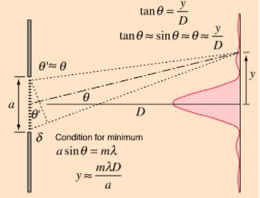
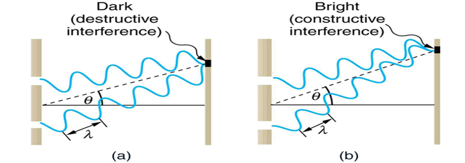


### Wave Nature of Light

Light exhibits a **dual nature** — it behaves both as:

1.  **Particle** (photon)
2.  **Wave** (electromagnetic wave)

When light interacts with obstacles or openings comparable to its wavelength (**λ**), it bends around the edges. This phenomenon is known as **diffraction**.

*Fig. 1 Diffraction Pattern by Single-slit*

### Key properties of waves that light exhibits:
* Diffraction
* Interference
* Superposition
* Polarization

These behaviours form the basis of this experiment.

---

## 1. Single-Slit Diffraction

When monochromatic light passes through a narrow slit of width **a**, it spreads out and forms a diffraction pattern on the screen.

### (i) Condition for Minima (Dark Fringes)

> **a · sinθ = mλ**  &nbsp;&nbsp; (m = ±1, ±2, ±3, …)  &nbsp;&nbsp;&nbsp; — (1)

**Where:**
* **a** → slit width
* **λ** → wavelength of light
* **θ** → angular position of minima
* **m** → diffraction order

### (ii) Linear Fringe Position on Screen

If the screen is at distance **D** from the slit:

> **y = mλD / a**  &nbsp;&nbsp;&nbsp; — (2)

### (iii) Key Observations

* **Central maximum:** Brightest and twice as wide as other maxima.
* **Side maxima:** Much weaker and decrease in intensity.
* **Higher-order maxima:** Spread further apart as **m** increases.
* **Effect of Slit/Wavelength:**
    * Narrower slit → wider diffraction pattern.
    * Longer wavelength → greater spreading.

> **Note:** This experiment demonstrates the wave nature of light and diffraction due to a double aperture.

---

## 2. Double-Slit Interference (Young's Experiment)

When coherent light passes through two slits separated by distance **d**, the waves overlap and interfere.

*Fig. 2 Young's double slit interference*

### 1. Fringe Width

> **β = λx / d**  &nbsp;&nbsp;&nbsp; — (3)

**Where:**
* **β** → fringe width
* **λ** → wavelength
* **x** → screen distance
* **d** → distance between slits

### 2. Interference Pattern

**Bright Fringes (Constructive Interference)**

> **Δ (Path difference) = nλ**  &nbsp;&nbsp;&nbsp; — (4)

**Dark Fringes (Destructive Interference)**

> **Δ (Path difference) = (2n + 1) · λ/2**  &nbsp;&nbsp;&nbsp; — (5)

*Fig. 3 Destructive and constructive interference*

### 3. Significance
1.  Confirms the **wave nature of light**.
2.  Supports **Huygens' Principle**.
3.  Demonstrates **superposition of waves**.

---

## 3. Electron Double-Slit Experiment (Quantum Theory)

This modern experiment shows that matter also behaves like waves (matter waves or de Broglie waves).

### 1. Key Observations

* Electrons fired one at a time still produce an interference pattern, which shows electrons behave like probability waves.
* If we measure which slit the electron passes through **(with detector):**
    * The interference pattern *disappears*.
    * Only two clump patterns remain (each corresponding to one slit).
    * The electron behaves like a classical particle.
    * Measurement collapses the wave function.

**Wave–Particle Duality:**
* Electrons behave like **particles** when detected.
* But behave like **waves** when propagating.

### 2. Implications

* Supports **de Broglie hypothesis**.
* Demonstrates **quantum superposition**.
* Shows **observer effect / wave function collapse**.
* Reveals that nature at the microscopic level is **probabilistic**, not deterministic.
